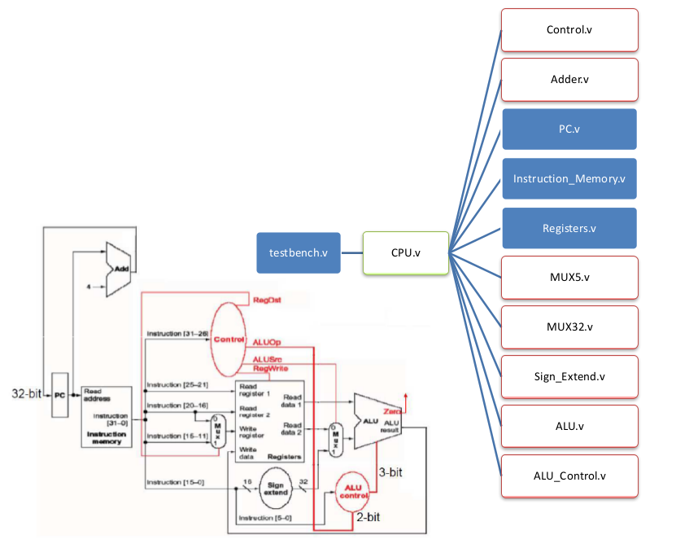
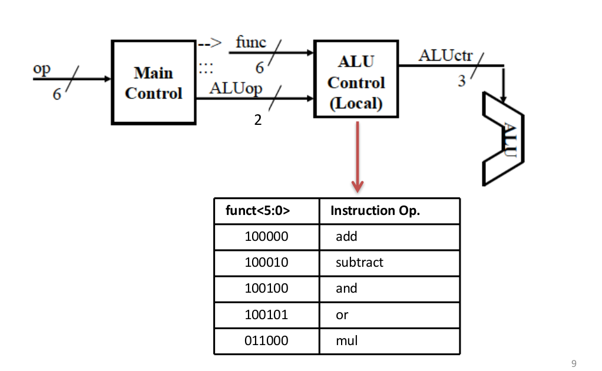

# Computer Architecture HW4
b04902045 孫凡耘

## Coding Environment
- Ubuntu 16.04
- iverilog version 0.9.7
- Compile Command:
```
#!/bin/bash 
set -ex
iverilog testbench.v \
         CPU.v \
         Instruction_Memory.v \
         PC.v \
         Registers.v \
         MUX32.v \
         MUX5.v \
         Sign_Extend.v \
         Control.v \
         ALU_Control.v \
         Adder.v \
         ALU.v 

vvp a.out
```

## Module Implementation

Basically, follow the following design.



### Adder
Simply add two 32 bits input with the `assign` keyword.

### MUX5, MUX32
Use continuous assignment and a one liner if-else selection

### Sign_Extend
The input data is 16 bits. Extend the first bit(index 15) 16 times and concatenate with the original input.

### ALU
Define parameters for operations to make the code more readable and pleasing. Note that INVALID_OPERATION is taken into consideration.

### Control and ALU_Control



Follow the two-layer designed above.
Since addi is the only I-type format, op-code for it is `001000`.

For all other instructions we need to implement, they all have the same op-code, which is `000000`.

Control

|  | R-type  | addi(I-type)
| ------------ | ------------ | -------------
op-code(6 bits input) | 000000 | 001000
alusrc | 0 | 1
regdst | 1 | 0 
aluop(2 bits) | 2'b00 | 2'b01 
regwrite | 1 | 1

Observe this table, we can use op-code[3] to determine alusrc ,regdst, and aluop. Regwrite is always 1. 

ALUControl

|  | R-type  | addi(I-type)
| ------------ | ------------ | -------------
funct(6 bits input)	 | Depends| Don't care
aluop(2 bits input) |  2'b00 | 2'b01
aluctrl(3 bits output) | Depends | ADD

If aluop is I-type, then set aluctrl to ADD. It not, set aluctrl according to the funct bits.


### CPU
Finally, connect all port together according to the graph above.

## Others

### Style
Basically, follow the style of TA's code. Some personal preferences are listed also.

- naming of variables are zero based, _i, _o denote input and output
- variables -> lowercase, separated by _. Module -> uppercase
- Specify port of module -> Specify interface -> Main calculation
- Use the keywork `assign` mainly for Continuous Assignment

### problem
iverilog compile warning
```
WARNING: testbench.v:33: $readmemb(instruction.txt): Not enough words in the file for the requested range [0:255].
```
doesn't seem to affect anything though
