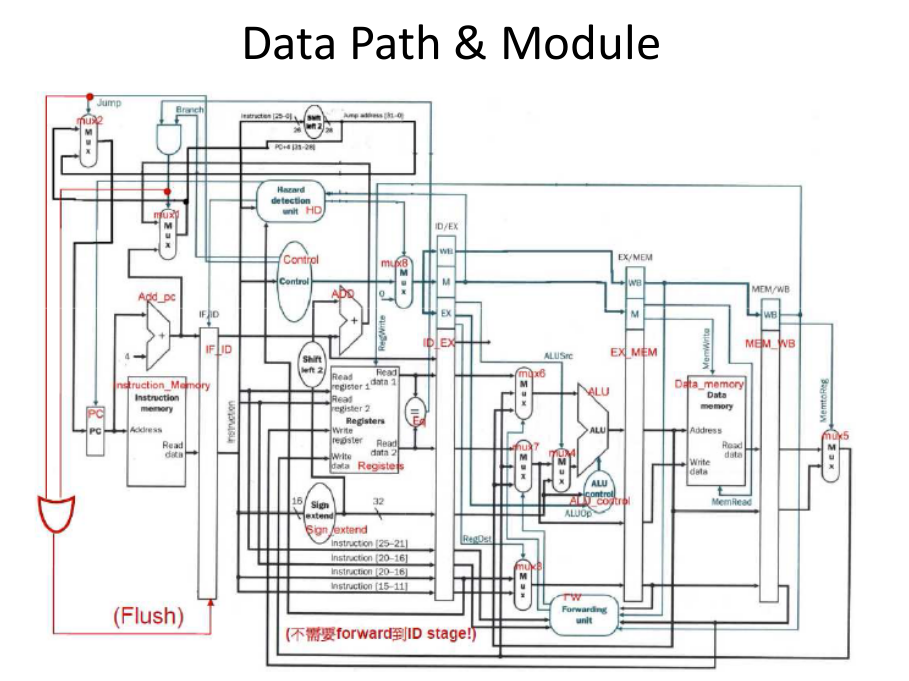
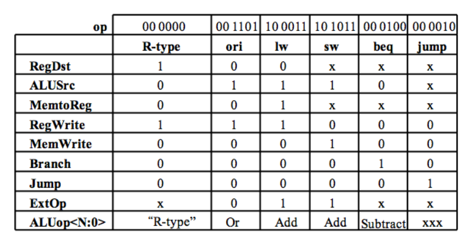

# Basics
***
* Group: 
* Member:　
  + 孫凡耘 B04902045
  + 戴培倫 B04902105
* Teamwork:
  - Pipeline(50%):戴培倫 
  - Hazard(50%):孫凡耘

# Modules
***

Basically, we follow the naming and design of the following data path:

### Adder
沿用上次作業的module
* port:
  + input:
    - 32-bit data0_i
    - 32-bit data1_i
  + output:
    - 32-bit data_o

There are two adders.
* Adder1 name: Add_PCAdvance
    + implement: 將PC與4相加
* Adder2 name: Add_PCBranch
    + implement: 將PC與sign_extend相加

### ALU
沿用上次作業的module
* port:
  + input:
    - 32-bit data0_i
    - 32-bit data1_i
    - 3-bit aluctrl_i
  + output:
    - 32-bit data_o
    - 1-bit zero_o
* implement:
  + 若aluctrl_i為3'b000，將data0_i和data1_i做and
  + 若aluctrl_i為3'b001，將data0_i和data1_i做or
  + 若aluctrl_i為3'b010，將data0_i和data1_i做add
  + 若aluctrl_i為3'b011，將data0_i和data1_i做multiple
  + 若aluctrl_i為3'b110，將data0_i和data1_i做substract
  + 若data_o為 0，將zero_o設為1，否則設為0

### PC
* module name: PC
* port:
  + input:
    - 1-bit clk_i
    - 1-bit rst_i
    - 1-bit start_i
    - 32-bit pc_i
    - 1-bit IsHazzard_i
  + output:
    - 32-bit pc_o
* implement:
    - 在rst_i   為0的狀態下，則pc_o = 0
    - 在start_i為1的狀態下，如果有hazard，就把pc_o = pc_i-4&nbsp;(stall 1 cycle)
    - 在start_i為1的狀態下，如果沒有hazard，就把pc_o = pc_i
    - 在start_i為0的狀態下，則pc_o = pc_o

### ALU_Control
* module name: ALU_Control
* port:
  + input:
    - 6-bit funct_i
    - 2-bit ALUOp_i
  + output:
    - 3-bit ALUCtr_o
* implement:
  + 如果ALUOp為2'b00，則將ALUCtr_o設為3'b010(add)
  + 其餘R-type判斷funct_i來決定對應的3-bit ALU Operation

### Sign_Extend
沿用上次作業的module
* port:
  + input:
    - 16-bit data_i
  + output:
    - 32-bit data_o 
* implement: 
    + 複製1~16的bit到data_o
    + 如果第16個bit為1，代表此數為負數，所以17~32的bit也為1
    + 如果第16個bit為0，代表此數為正數，所以17~32的bit也為0

### Instruction_Memory
沿用上次作業的module
* port:
  + input:
    - 32-bit addr_i
  + output:
    - 32-bit instr_o
* implement:
  + 將&nbsp;addr_i&nbsp;左移2(乘4)
  + 提取在memory[addr_i << 2]的instruction放到instr_o

### Data Memory
* module name: Data_memory
* port:
  + input:
    - 1-bit clk_i
    - 32-bit RDaddr_i
    - 32-bit RDdata_i
    - 1-bit MemRead_i
    - 1-bit MemWrite_i
  + output:
    - 1-bit IsMemWrite
    - 1-bit IsMemRead
    - 32-bit data_o
* implement:
    - 分為兩個部分:當clk_i變成1 或 IsMemRead或memory變動的狀況
    - 當clk_i變成1，則檢查MemWrite signal是否為1，若為1，則將data_i的資料分別寫入memory[addr] 
      到memory[addr+3]，反之則否
    - 當IsMemRead或memory有變動，則檢查MemRead signal是否為1，若為1， 則將memory[addr] 
      到memory[addr+3]內的資料分別讀出，並寫入data_o，反之則否

### MUX
* MUX1 (MUX32)
  * port:
    + input:    
      - 32-bit data0_i (branch_addr)
      - 32-bit data1_i (add_pc + 4)	
      - 1-bit Isbranch_i (IsBranch & register_equal)
    + output:
      - 32-bit data_o
  * implement:
      - 如果Isbranch_i為1，表示此instruction為branch，將data0_i存入data_o
      - 如果Isbranch_i為0，表示此instruction不是branch，將data1_i存入data_o 
    
* MUX2 (MUX32)
  * port:
    + input:    
      - 32-bit data0_i (mux1.data_o)
      - 32-bit data1_i (jump_address)	
      - 1-bit Isjump_i (isJump)	
    + output:
      - 32-bit data_o
  + implement:
    - 如果Isjump_i為1，表示此instruction為jump，將data1_i存入data_o
    - 如果Isjump_i為0，表示此instruction不是jump，將data0_i存入data_o 
    - 
* MUX3 (MUX5)
  * port:
    + input:    
      - 32-bit data0_i (ID_EX.RT)
      - 32-bit data1_i (ID_EX.RD)	
      - 1-bit IsRegDst_i	
    + output:
      - 32-bit data_o
  + implement:
    - 如果IsRegDst_i為1，表示此instruction最後要存入RD，將data1_i存入data_o
    - 如果IsRegDst_i為0，表示此instruction最後要存入RT，將data0_i存入data_o
* MUX4 (MUX32)
  * port:
    + input:    
      - 32-bit data0_i (mux7's result)
      - 32-bit data1_i (sign extend result)	
      - 1-bit IsALUSrc_i	
  + output:
    - 32-bit data_o
  + implement:
    - 如果IsALUSrc_i為1，表示ALU要使用sign extend的資料，將data1_i存入data_o
    - 如果IsALUSrc_i為0，表示ALU要使用mux7的結果，將data0_i存入data_o  
* MUX5 (MUX32)
  * port:
    + input:    
      - 32-bit data0_i (read data from memory)
      - 32-bit data1_i (ALU result)	
      - 1-bit IsMemtoReg_i	
  + output:
    - 32-bit data_o
  + implement:
    - 如果IsMemtoReg_i為1，表示最後要回傳的資料是memory讀出來的資料，將data0_i存入data_o
    - 如果IsMemtoReg_i為0，表示最後要回傳的資料是ALU的結果，將data1_i存入data_o

### Control
* port:
  + input:
    - 6-bit Op_i
  + output:
    - 1-bit RegDst_o
    - 2-bit ALUOp_o
    - 1-bit ALUSrc_o
    - 1-bit RegWrite_o
    - 1-bit MemToReg_o
    - 1-bit MemWrite_o
    - 1-bit IsBranch_o
    - 1-bit IsJump_o
* implement:
  Inspect this truth table:
  

    - 在定完module的雛型之後，先分別定義control的0~7bit所代表的意義
      - WB: 
        + Control_o[0]: RegWrite
        + Control_o[1]: MemtoReg
      - M :  
        + Control_o[2]: MemRead
        + Control_o[3]: MemWrite
      - EX :
        + Control_o[4]: ALUSrc
        + Control_o[7]: RegDst
        + Control_o[5:6] is ALUOp 2 bit

    - 一開始先將Branch_o和Jump_o設為0
      - 若Inst_i是6'b000000(R-type)，將Control_o 設為11000001
      - 若Inst_i是6'b001000(addi)，將Control_o 設為10010001
      - 若Inst_i是6'b101011(sw)，將Control_o 設為00011000
      - 若Inst_i是6'b100011(lw)，將Control_o 設為00010111
      - 若Inst_i是6'b000010(j)，將Control_o 設為00000000，並將Jump_o設為1
      - 若Inst_i是6'b000100(beq)，將Control_o 設為00100000，並將Branch_o設為1

### Shift_Left2
* port:
  + input:    
    - 32-bit data_i (Sign_Extend.out)
  + output:
    - 32-bit data_o
  + implement:
    - 往左 shift 2 bit，空白的 bit 補 0
* Shift_Left2 name: Shift_Left2_Jump
* port:
  + input:    
    - 32-bit data_i (IF_ID.instruction)
  + output:
    - 32-bit data_o
  + implement:
    - 往左 shift 2 bit，空白的 bit 補 0

### CPU
* port:
  + input:
    - 1-bit clk_i
    - 1-bit rst_i
    - 1-bit start_i
* wire: registers_equal, pc_src_branch_select, flush
* implement:
將所有module相互連接(利用and/or等邏輯閘連接一些wire)

## Pipeline Implementation

There are four main unit(IF_ID、ID_EX、EX_MEM、MEM_WB) when implementing pipeline:
  + 這四個 unit 每經過一次 clock cycle 便會輸出上一次 clock cycle 進來的 input
  + 當有 instruction 進來的時候，會先在兩個相鄰的 unit 間跑完所有的需要的步驟(Fetch, Decode...)，然後等待下一個 clock cycle
  + 因此每一個 instruction 只會占用相鄰兩個 unit 之間的資源，其他 instruction 就可以依序利用其他資源；又因為四個 unit 將 CPU 分為5個 block，所以最多同時會有5個不同的 instruction 在 CPU 上執行

### IF_ID
* port:
  + input:
    - 1-bit clk_i
    - 32-bit inst_i
    - 32-bit pc_i
    - 1-bit hazard_in
    - 1-bit flush
  + output:
    - 32-bit inst_o
    - 32-bit pc_o
* implement:
  + 經過一次clock cycle後，所有ouput輸出對應的input
  + 若出現flush，將inst_o設為0
  + 若出現hazard，將inst_o不變

### ID_EX
* port:
  + input:
    - 1-bit clk_i
    - 32-bit inst_i
    - 32-bit pc_i
    - 32-bit RDData0_i
    - 32-bit RDData1_i
    - 32-bit SignExtended_i
    - 1-bit RegDst_i
    - 2-bit ALUOp_i
    - 1-bit ALUSrc_i
    - 1-bit RegWrite_i
    - 1-bit MemToReg_i
    - 1-bit MemRead_i
    - 1-bit MemWrite_i
  + output:
    - 32-bit inst_o
    - 32-bit pc_o
    - 32-bit RDData0_o
    - 32-bit RDData1_o
    - 32-bit SignExtended_o
    - 1-bit RegDst_o
    - 2-bit ALUOp_o
    - 1-bit ALUSrc_o
    - 1-bit RegWrite_o
    - 1-bit MemToReg_o
    - 1-bit MemRead_o
    - 1-bit MemWrite_o
* implement:
  + 經過一次clock time後，所有output輸出相對應的input

### EX_MEM
* port:
  + input:
    - 1-bit clk_i
    - 32-bit pc_i
    - 1-bit zero_i
    - 32-bit ALUResult_i
    - 32-bit RDData_i
    - 32-bit RDaddr_i
    - 1-bit RegWrite_i
    - 1-bit MemToReg_i
    - 1-bit MemRead_i
    - 1-bit MemWrite_i
  + output:
    - 32-bit pc_o
    - 1-bit zero_o
    - 32-bit ALUResult_o
    - 32-bit RDData_o
    - 32-bit RDaddr_o
    - 1-bit RegWrite_o
    - 1-bit MemToReg_o
    - 1-bit MemRead_o
    - 1-bit MemWrite_o
* implement:
  + 經過一次clock time後，所有output輸出相對應的input

### MEM_WB
* port:
  + input:
    - 1-bit clk_i
    - 32-bit RDData_i
    - 32-bit ALUResult_i
    - 32-bit RDaddr_i
    - 1-bit RegWrite_i
    - 1-bit MemToReg_i
  + output:
    - 1-bit RegWrite
    - 1-bit MemtoReg
    - 32-bit RDData_o
    - 32-bit ALUResult_o
    - 5-bit RDaddr_o
* implement:
  + 經過一次clock time後，所有output輸出相對應的input

## Hazard Detection

### Forwarding
* port: 
  + input: 
    - 1-bit EX_MEM_RegWrite
    - 1-bit MEM_WB_RegWrite 
    - 5-bit EX_MEM_RegisterRd
    - 5-bit MEM_WB_RegisterRd 
    - 5-bit ID_EX_RegisterRs  
    - 5-bit ID_Ex_RegisterRt
  + output: 
    - 2-bit ForwardA
    - 2-bit ForwardB
* implement:
  + ForwardA表示Rs的forwarding
  + ForwardB表示Rt的forwarding
  + 00: 不用forwarding
  + 10: 發生 EX Hazard, 需要forward至EX stage
  + 01: 發生 MEM Hazard, 需要forward至MEM stage

### HazardDetection
* port:
  + input:
    - 1-bit ID_EX_MemRead
    - 5-bit IF_ID_RegisterRs
    - 5-bit IF_ID_RegisterRt
    - 5-bit ID_EX_RegisterRt
  + output:
    - 1-bit PC_Write
    - 1-bit IF_ID_Write
    - 1-bit data_o
* implement:
若偵測到有 hazard 可能發生，寫入PC與IF/ID以進行stall動作

### MUX_Forward
* MUX6 (MUX_Forward)
  * port:
    + input:    
      - 32-bit data0_i (ID_EX's read data1)
      - 32-bit data1_i (from Registers's result)
      - 32-bit data2_i (from ALU's result)	
      - 1-bit IsForward_i	
    + output:
      - 32-bit data_o
  + implement:
    - 如果IsForward_i為00，表示不用forward，直接使用ID_EX傳出來的data0，將data0_i存入data_o
    - 如果IsForward_i為01，表示需要forward，並需要後面Register傳回來的資料，將data1_i存入data_o
    - 如果IsForward_i為10，表示需要forward，並需要後面ALU傳回來的資料，將data2_i存入data_o
    - 如果IsForward_i為11，則將data0_i存入data_o(不做處理)
* mux7 (MUX_Forward)
  * port:
    + input:    
      - 32-bit data0_i (ID_EX's read data2)
      - 32-bit data1_i (from Registers's result)
      - 32-bit data2_i (from ALU's result)	
      - 1-bit IsForward_i	
    + output:
      - 32-bit data_o
  + implement:
    - 如果IsForward_i為00，表示不用forward，直接使用ID_EX傳出來的data1，將data0_i存入data_o
    - 如果IsForward_i為01，表示需要forward，並需要後面Register傳回來的資料，將data1_i存入data_o
    - 如果IsForward_i為10，表示需要forward，並需要後面ALU傳回來的資料，將data2_i存入data_o
    - 如果IsForward_i為11，將data0_i存入data_o(不做處理)
* mux8 name: MUX8 (MUX8)
* port:
  + input:
    - 1-bit IsHazzard_i
    - 1-bit RegDst_i
    - 2-bit ALUOp_i
    - 1-bit ALUSrc_i
    - 1-bit RegWrite_i
    - 1-bit MemToReg_i
    - 1-bit MemRead_i
    - 1-bit MemWrite_i
  + output:
    - 1-bit RegDst_o
    - 2-bit ALUOp_o
    - 1-bit ALUSrc_o
    - 1-bit RegWrite_o
    - 1-bit MemToReg_o
    - 1-bit MemRead_o
    - 1-bit MemWrite_o
  + implement:
    - 如果IsHazzard_i為1，表示發生stall，將0存入各個output data_o
    - 如果IsHazzard_i為0，表示沒有發生stall，將input data_i存入output data_o

***
# Problems
+ 對verilog語法不熟，在pipeline的4個unit理，會想要把wire寫在procedural block裡面的left-hand side
sol: 複習了verilog tutorial file. Remember two main rules:
  + Can not use “reg” in left-hand side of continuous assignment.
  + Can not use “wire” in left-hand side of assignment in procedural block.

+ 命名(頭腦)混亂
sol: 
  + establish some simple coding rules. For examples, append _i, _o after variables to distinguish whether it's an input or output type. 
  + Record input and ouput ports of all modules into a single file.

+ 當 wire/register 為 x 時的判斷
sol: Initialize all register to 0 to avoid the occurrence of "x".
