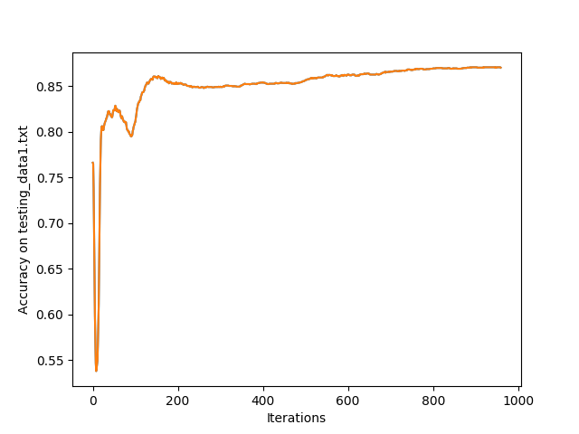

DSP HW1: Discrete Hidden Markov Model Implementation
====================================================

By Fan-Yun Sun(b04902045)

## Runtime Environment

- System: Ubuntu 16.04
- Compiler: gcc version 5.4.0
- compile flag: `g++ -O3 -std=c++14 -Wall -Wextra -Wshadow -Wno-unused-result`

## Train

    ./train ITERATION INPUT_INIT_MODEL INPUT_SEQ OUTPUT_MODEL

- `ITERATION` 為正整數，表示training 要跑幾次 iterations
- `INPUT_INIT_MODEL` 是初始 model 檔案
- `INPUT_SEQ` 是訓練用的 observation data 檔案
- `OUTPUT_MODEL` 要輸出的 model 檔案

## Test

    ./test MODEL_LIST TEST_DATA RESULT

- `MODEL_LIST` 是一個文字檔，裡面列出所有的 models
- `TEST_DATA` 要跑測試用的檔案
- `RESULT` 輸出的 model 串列檔案

## Accuracy

我用 python 寫了 `calc_acc.py`，用來比較 test result 與 reference result ，計算出答對的比率

    python calc_acc.py PRED_FILE ANS_FILE

## coding style spec
* Everything is zero based
* 用c++ 14寫，讀檔用C的語法
* 安全起見, `-Wall -Wextra -Wshadow -Wno-unused-result`這些compile flag全開

## list of reminders(bugs)

* MAX_SEQ, MAX_OBSERV, MAX_STATE 再宣告參數時弄錯搞混
* make sure what variables should be reinitialized after a per-sample iteration or a complete iteration is completed
* use the keyword `static`

## Result

我把 `testing_data-1` 的 accuracy 依照不同的 #(iterations) 來記錄，
用圖表來顯示 accuracy 的變化。
我寫了一個script `run.sh`
讓我的程式從iteration 1跑到950並把整個過程的accuracy都紀錄下來。結果如圖

Plotting tools used: matplotlib for python

