DSP HW2-1: HMM Training and Testing
====================================================

By Fan-Yun Sun(b04902045)

## Runtime Environment

- System: Ubuntu 16.04
- Compiler: gcc version 5.4.0

## Change on the number of states

number of states = 5

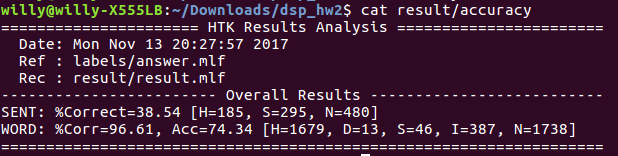

number of states = 10

number of states = 15

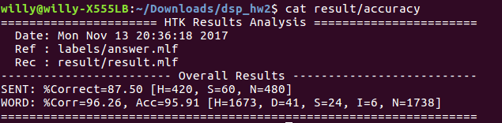

Increasing the # of states does increase the accuracy dramatically.

## Increase the number of Gaussian Mixtures

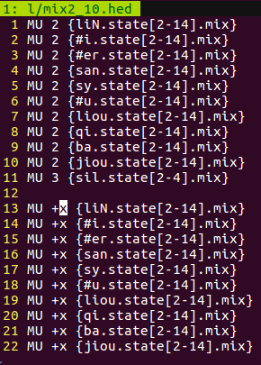

This experiment is conducted by changing the value of x. Note that all other parameters are fixed in this experiment.

x = 1

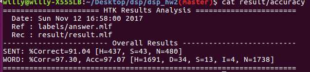

x = 3

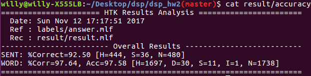

x = 8

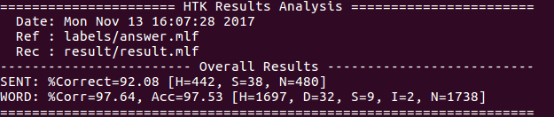

x = 11

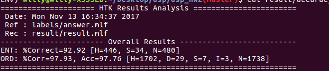

x = 20

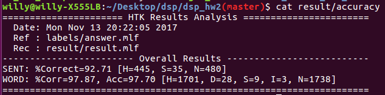

If we fix the number of iterations, increasing the number of gmm can improve the accuracy, but only to a certain extent.
Improvement is very limited.

## Change on the number of iterations

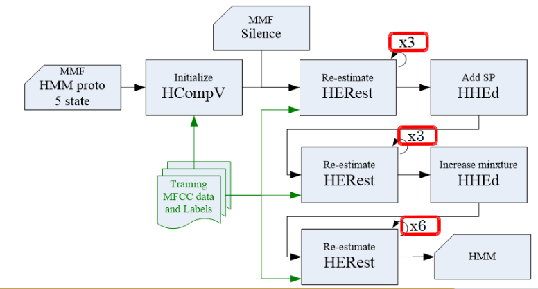

I conducted experiments with different number of iterations. Note that all three parameters shown in the graph are all changed to the same number. All other parameters are fixed in this experiment.

Iteration: 3

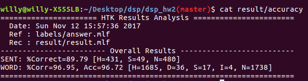

Iteration: 10

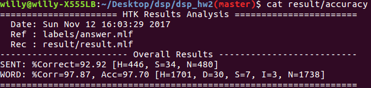

Iteration: 50

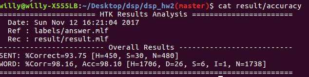

Iteration: 100

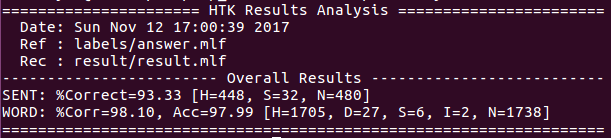

Increasing the iteration does help. But too many iterations may have negative impact.

## Final Results

I changed three files. 

- `lib/proto`: # state -> 15
- `lib/mix2_10.hed`: # of gmm -> 2 +20 (refer to the first figure, x=20)
- `03_training.sh`: # of iterations -> 50

The final result is shown as below.

